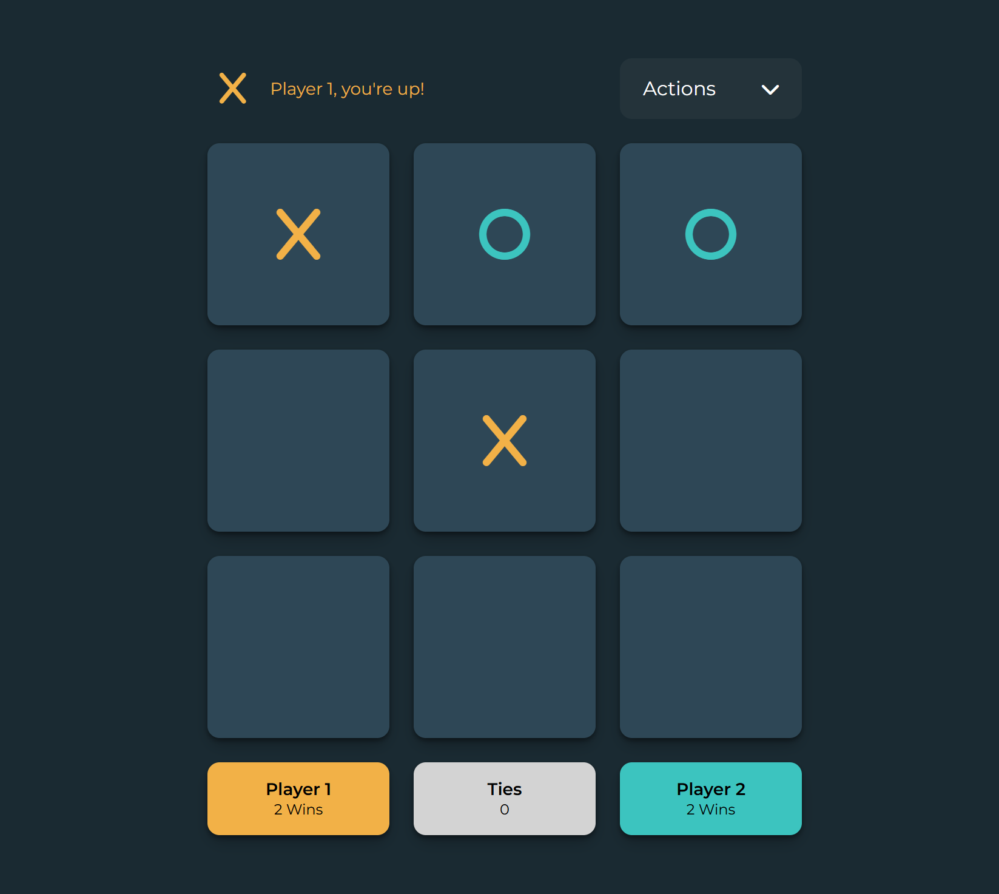

# TIC-TAC-TOE PROJECT

## This frontend web development project is based on a tutorial. It offers a great opportunity to enhance skills in HTML, CSS, JavaScript, TypeScript, and React.

You can find the 🎥 tutorial here: [Watch on YouTube](https://www.youtube.com/watch?v=MsnQ5uepIaE), and the 💻 code here:[ View on GitHub.](https://github.com/zachgoll/tic-tac-toe-subscriber-refactor)

The tutorial covers:

- Section 1: Building a Tic Tac Toe game with Vanilla HTML/CSS/JS
- Section 2: Refactoring the game to use the MVC pattern, with an explanation of its benefits
- Section 3: Refactoring the game to TypeScript, learning how to set up TypeScript from scratch and why it's useful
- Section 4: Refactoring the game to React + TypeScript, explaining how to set up React from scratch and exploring the advantages of React over a Vanilla approach

Many thanks go to [@zachgoll](https://github.com/zachgoll) for the tutorial and resources.

Here an Img of my Tic-tac-toe Web App:

